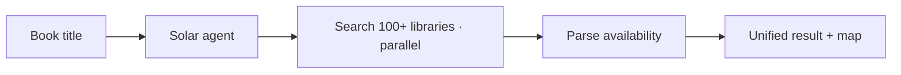

# 📚 BookToss v2

> Rebuild from scratch — searching 100+ Seoul libraries at once with an AI agent,
> this time powered by **Upstage Solar** instead of OpenAI.

## 한눈에

| | |
|---|---|
| **무엇** | 서울 100+ 도서관을 한 번에 검색하는 AI 에이전트 |
| **이번 변화** | 두뇌를 OpenAI → **Upstage Solar** (`solar-pro2`) 로 교체 |
| **스택(목표)** | Solar · browser-use · LangGraph · Streamlit |
| **방식** | 빈 루트에서 한 step씩 — 과정을 전부 문서화 |

## How it works

## 📖 전 과정을 한 페이지 튜토리얼로 정리했습니다

빈 폴더에서 시작해 도서관 검색 AI를 완성하기까지, **무엇을** 했는지뿐 아니라
***왜*** 그렇게 했는지를 한 페이지에 죽 적었습니다. 예를 들면:

- 🌱 **왜 `git checkout --orphan`으로 시작했나** — "처음부터"를 진짜 0에서 만드는 법
- 🔁 **OpenAI → Solar, 코드를 거의 안 바꾸고 두뇌만 교체하는 트릭** (`base_url` 하나)
- 🤖 **browser-use가 LLM으로 도서관 사이트를 직접 클릭·검색하는 원리**
- 🧩 **LangGraph 파이프라인** — `resolve_catalog → search_book → parse_html`
- 🛠️ **막혔던 지점들** — Pages가 옛 커밋만 배포하던 문제 같은 실전 디버깅까지

명령어를 그대로 복사하면 누구나 재현할 수 있습니다.

## 진행 상황

목표를 v0.0.1 → **v0.1.0**(도서관 1곳 end-to-end 검색)까지 10단계로 쪼갰습니다.
전체 로드맵과 각 단계 상태는 [튜토리얼 페이지](https://bookseal.github.io/Booktoss/#roadmap)에서 봅니다.

| | 내용 | 상태 |
|------|------|------|
| 사전 준비 | 깨끗한 출발점 — orphan 시작, v1을 `docs/v1/`에 보존 | ✅ |
| v0.0.1 | Streamlit "Hello, BookToss" 화면 띄우기 | ✅ |
| **v0.0.2** | Solar API 연결 (터미널에서 첫 호출 성공) | ⏳ 다음 |
| … | (v0.0.3 → … → v0.1.0 도서관 1곳 검색) | 예정 |

## v1 원본 (참고용)

`docs/v1/`에 원본 해커톤 프로젝트(`app.py`, `00_src/` LangGraph 파이프라인,
`catalog_index.yaml` 도서관 맵, 발표 자료)가 그대로 보존돼 있습니다. 재사용할
부분(도서관 URL 설정, HTML 파싱 규칙)만 골라 v2로 옮깁니다.
