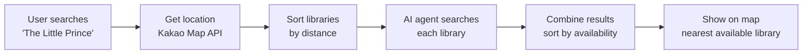
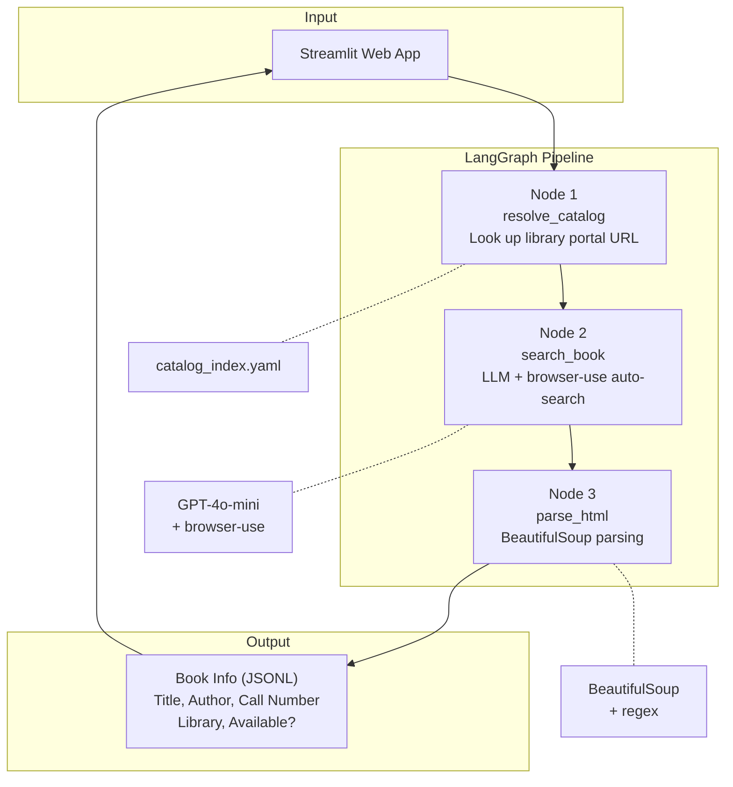
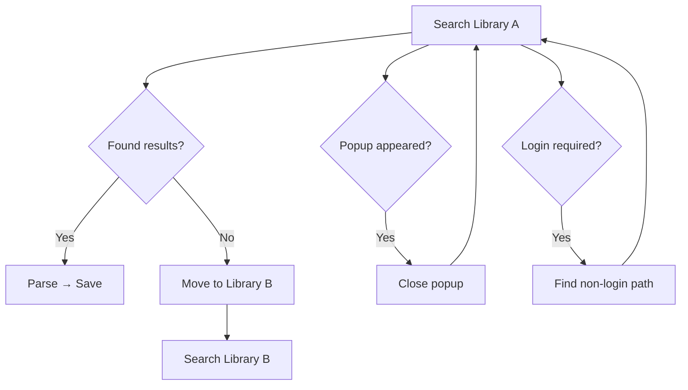
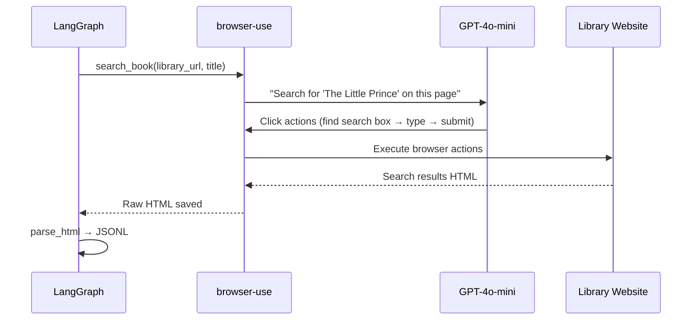

# 📚 BookToss

> **AI agent that searches multiple libraries at once — no API needed.**  
> Find books across 100+ libraries in Seoul, check availability, and see the nearest one on a map. One click.

**Live at https://booktoss.bit-habit.com**

---


## Why This Exists

Seoul has 25 districts. Each district runs its own library website. **None of them provide an API.**

To find a single book, a user has to:

```
Search for nearby libraries on Naver Maps
  → Visit library website
  → Close 3-4 popups ("Don't show today" × 3)
  → Search for the book
  → Scroll through a mixed list of available/unavailable copies
  → Repeat for the next library
```

BookToss replaces this entire process with **one click**.

### Three Core Problems

| # | Problem | Impact |
|---|---|---|
| 1 | **Fragmented sites** — 25 districts, 25 separate websites | No unified search |
| 2 | **Popup noise** — 3-4 popups per site | Hard to even reach the search box |
| 3 | **Messy availability** — available and unavailable mixed together | Can't tell at a glance |

---

## How It Works

### User Flow



### LangGraph 3-Step Pipeline



---

## Why LangGraph?

A simple sequential chain can't handle the real world. Each library website is different — different UI, different popups, different error states.



LangGraph supports **cycles and state management**, so the agent can:
- "Not found at Library A → try Library B" — **graph cycles**
- "Popup appeared → close it → retry" — **conditional branching + state recovery**
- "Search failed → fallback" — **error handling nodes**

This makes the system **resilient** — it handles messy real-world websites the way a human would.

---

## Core Components

| Component | File | What it does |
|---|---|---|
| **resolve_catalog** | `00_src/nodes/resolve_catalog.py` | Looks up the library portal URL from YAML config |
| **search_book** | `00_src/nodes/search_book.py` | GPT-4o-mini + browser-use auto-searches each library. Handles SPAs |
| **parse_html** | `00_src/nodes/parse_html.py` | Parses HTML for each district's unique page structure |
| **Streamlit App** | `app.py` | Kakao Map API location service, 100+ library database |

### How Browser Automation Works



---

## Tech Stack

### AI/ML
| Technology | Purpose |
|---|---|
| **LangGraph** | Workflow orchestration — cycles, state, conditional branching |
| **OpenAI GPT-4o-mini** | Drives browser automation — learns each library's UI |
| **browser-use** | AI-powered web browser control |

### Backend
| Technology | Purpose |
|---|---|
| **Python 3.12** | Core runtime |
| **BeautifulSoup4** | HTML parsing — handles each district's unique structure |
| **asyncio** | Async browser control |
| **Playwright** | Speed optimization (refactored from browser-use) |

### Frontend
| Technology | Purpose |
|---|---|
| **Streamlit** | Web UI |
| **Kakao Map API** | User location, library map visualization |

---

## Results

| Metric | Before (manual) | After (BookToss) |
|---|---|---|
| Search time | ~5 min per library | **~1 min total** |
| Clicks needed | 15-20 | **1** |
| Popup handling | Close manually | **Auto-removed** |
| Availability | Mixed in one list | **Sorted: available first** |

---

## Team & My Role

**2025 IA × AI Hackathon** — 3-person team

| Member | Role |
|---|---|
| Jungmin Hong | LangGraph backend pipeline, system architecture, LLM agent |
| **Gichan Lee** | **Oracle Cloud deployment, Nginx reverse proxy, SSL automation — Infra/DevOps** |
| Sumin Lee | Streamlit frontend, public library service research |

---

## Project Structure

```
BookToss/
├── app.py                          # Streamlit web app
├── requirements.txt
│
├── 00_src/
│   ├── graph/
│   │   └── pipeline_graph.py       # LangGraph pipeline
│   ├── nodes/
│   │   ├── resolve_catalog.py      # Portal URL lookup
│   │   ├── search_book.py          # LLM browser automation
│   │   └── parse_html.py           # HTML parsing
│   ├── configs/
│   │   └── catalog_index.yaml      # Library portal URL mapping
│   └── data/
│       ├── raw/                    # Raw HTML
│       └── parsed/                 # Parsed JSONL
│
└── .env                            # API keys (gitignored)
```

---

## Quick Start

**Already deployed** at booktoss.bit-habit.com.

```bash
# Run locally
git clone https://github.com/2025-IA-x-AI-Hackathon/Hack-BookToss.git
cd Hack-BookToss
python -m venv venv && source venv/bin/activate
pip install -r requirements.txt

# Set API keys in .env
OPENAI_API_KEY=your_key
KAKAO_REST_KEY=your_key
KAKAO_API_KEY=your_key

# Run
streamlit run app.py

# Or use CLI
PYTHONPATH=00_src python -m graph.pipeline_graph --place gangnam --title "코스모스"
```

---

## Roadmap

- [ ] Expand to all 25 Seoul districts
- [ ] Add book reservation
- [ ] Nationwide public library support
- [ ] Mobile app (React Native)

---

Built with LangGraph + browser-use. Deployed on Oracle Cloud (k3s).
