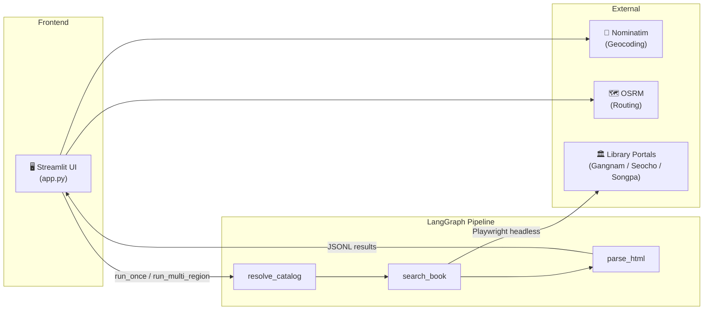
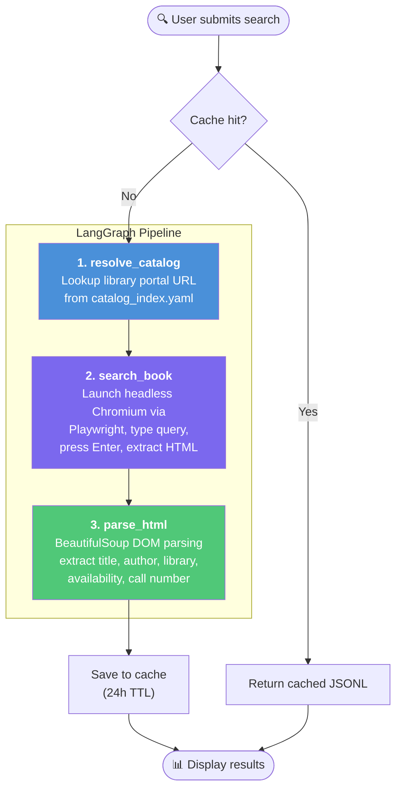
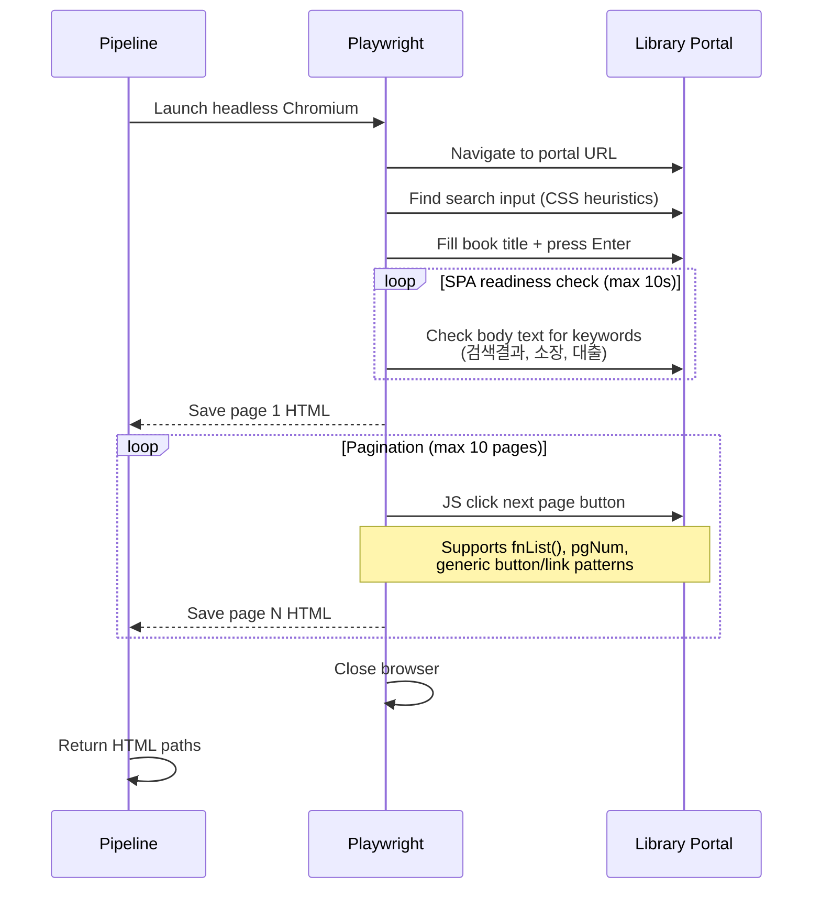

# 📚 BookToss

> Find available books at nearby public libraries in Seoul — powered by Playwright browser automation and LangGraph pipelines.

**BookToss** is a Streamlit-based web application that searches multiple Seoul district library portals (Gangnam, Seocho, Songpa) to check real-time book availability and shows the nearest library on a map.

## Architecture Overview



## Pipeline Workflow

The core search logic is a **3-node LangGraph pipeline** that executes sequentially:



### Node Details

| Node | File | Description |
|------|------|-------------|
| **resolve_catalog** | `00_src/nodes/resolve_catalog.py` | Reads `catalog_index.yaml` to map a region code (`gangnam`, `seocho`, `songpa`) to the library portal URL |
| **search_book** | `00_src/nodes/search_book.py` | Uses **raw Playwright** (no browser-use) to launch headless Chromium, navigate to the portal, fill the search input, submit, wait for SPA rendering, and save multi-page HTML |
| **parse_html** | `00_src/nodes/parse_html.py` | Parses saved HTML files with BeautifulSoup, extracts book records (title, author, library, availability, call number, cover image, return date), deduplicates, and writes JSONL |

## Project Structure

```
Booktoss/
├── app.py                          # Streamlit web application
├── requirements.txt                # Python dependencies
├── requirements-linux.txt          # Linux-specific dependencies
├── scripts/
│   └── install-playwright.sh       # Playwright browser installer
└── 00_src/
    ├── configs/
    │   ├── catalog_index.yaml      # Library portal URL registry
    │   └── selectors.yaml          # CSS selectors config
    ├── graph/
    │   └── pipeline_graph.py       # LangGraph pipeline definition
    ├── nodes/
    │   ├── resolve_catalog.py      # Node 1: URL resolution
    │   ├── search_book.py          # Node 2: Playwright search
    │   └── parse_html.py           # Node 3: HTML parsing
    ├── utils/
    │   └── cache.py                # Result caching system (24h TTL)
    └── data/
        ├── raw/                    # Saved HTML snapshots (by date)
        ├── parsed/                 # Parsed JSONL results (by date)
        └── cache/                  # Cached search results
```

## Key Features

- **Pure Playwright automation** — no LLM-based browser agent; deterministic, fast, and cost-free
- **Multi-region parallel search** — searches Gangnam, Seocho, and Songpa simultaneously using `ThreadPoolExecutor`
- **Multi-page crawling** — automatically clicks through pagination (up to 10 pages) via JavaScript injection
- **Smart caching** — 24-hour TTL cache avoids redundant browser sessions
- **Interactive map** — Leaflet.js + OpenStreetMap with OSRM driving routes
- **Export** — download results as CSV or JSON

## Setup

```bash
# 1. Clone and enter the project
git clone https://github.com/bookseal/Booktoss.git
cd Booktoss
git checkout playwright-only

# 2. Create virtual environment
python3.11 -m venv venv
source venv/bin/activate

# 3. Install dependencies
pip install -r requirements-linux.txt

# 4. Install Playwright browsers
playwright install chromium
playwright install-deps

# 5. Configure environment variables
cp .env.example .env
# Edit .env and set KAKAO_REST_KEY, KAKAO_API_KEY (for map links)

# 6. Run the app
streamlit run app.py --server.port 8501
```

## CLI Usage

Run the pipeline directly from the command line:

```bash
# Single region search
PYTHONPATH=00_src python -m graph.pipeline_graph \
  --place gangnam --title "어린 왕자"

# Multi-region search (all 3 districts)
PYTHONPATH=00_src python -m graph.pipeline_graph \
  --place all --title "트렌드 코리아 2025"

# Skip cache
PYTHONPATH=00_src python -m graph.pipeline_graph \
  --place seocho --title "어린 왕자" --no-cache

# Clear expired cache
PYTHONPATH=00_src python -m graph.pipeline_graph --clear-cache
```

## How `search_book` Works (Playwright-Only)



## Environment Variables

| Variable | Required | Description |
|----------|----------|-------------|
| `KAKAO_REST_KEY` | Optional | Kakao REST API key (map direction links) |
| `KAKAO_API_KEY` | Optional | Kakao JavaScript API key |
| `HEADLESS` | Optional | Set to `false` to see the browser (default: `true`) |

## License

MIT
